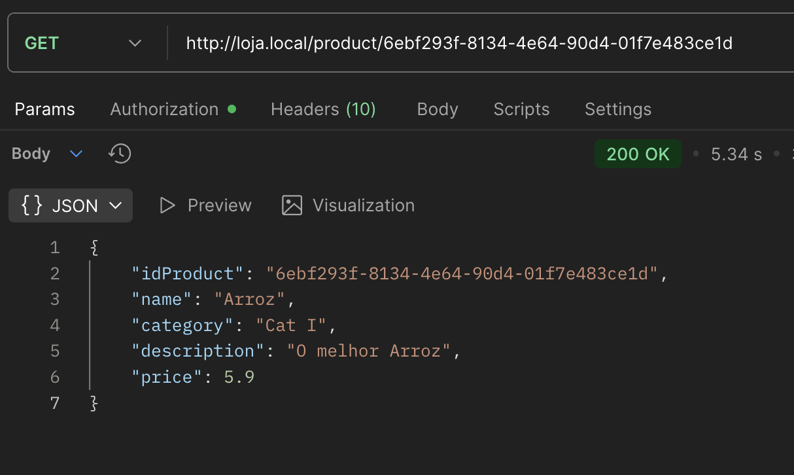
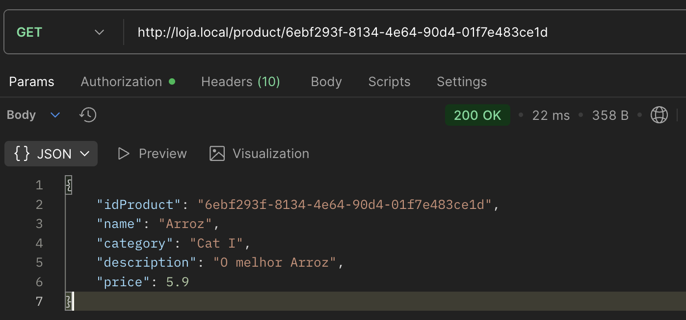
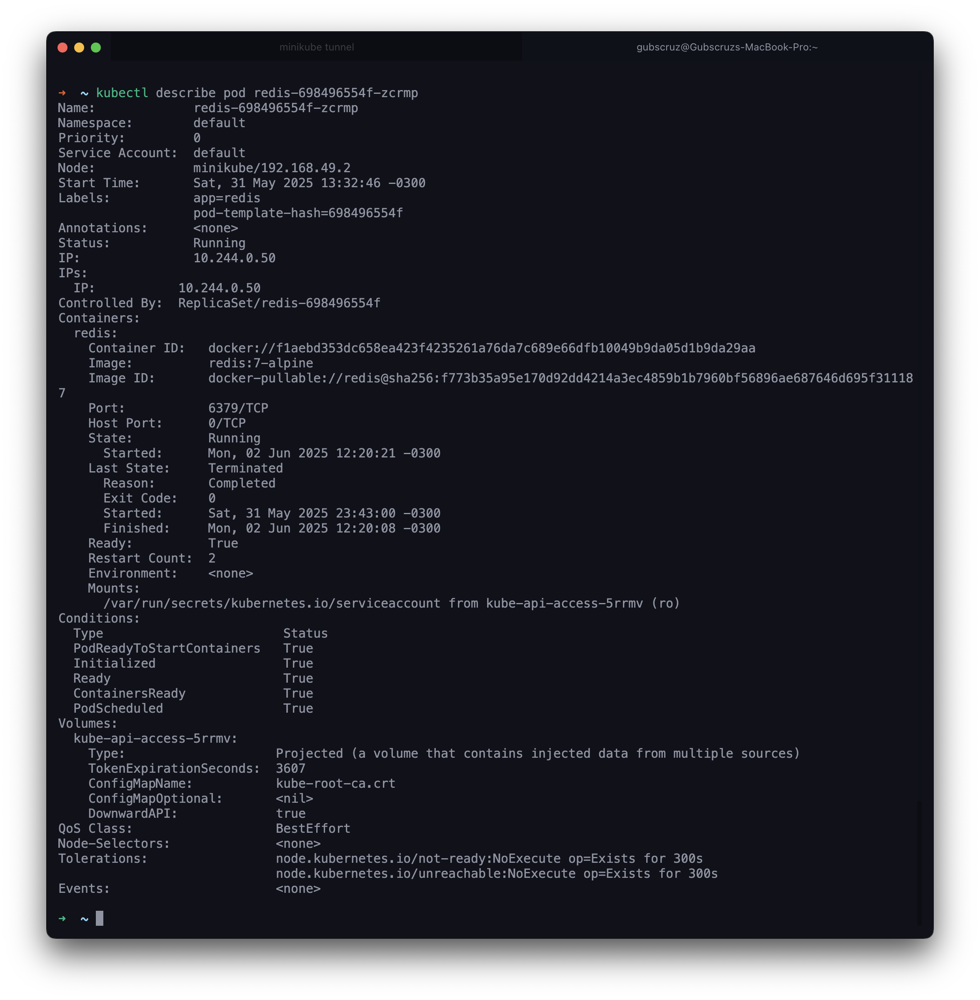

For the cache logic, I used **Redis** as the caching solution. Redis is an in-memory data structure store that can be used as a database, cache, and message broker. It is known for its speed and efficiency in handling data.

Redis was deployed as a Kubernetes pod in the Minikube cluster. The setup file is located as follows:

```
api/
  ├── k8s/
  │ └── redis.yaml
```

It was implemented in the **Product Service** and the **Order Service**. 

## Results in the requests

When making a request to get a product, the first request took about **5 seconds** to respond on postman,
the second request took about **22 milliseconds**, showing that the product was cached in Redis and the efficiency of the cache.

=== "No Cache"
    { width=100% }

=== "With Cache"
    { width=100% }


!!! info "Redis setup"
    
    === "redis.yaml"
        ```yaml
        apiVersion: apps/v1
        kind: Deployment
        metadata:
        name: redis
        spec:
        replicas: 1
        selector:
            matchLabels:
            app: redis
        template:
            metadata:
            labels:
                app: redis
            spec:
            containers:
            - name: redis
                image: redis:7-alpine
                ports:
                - containerPort: 6379
        ---
        apiVersion: v1
        kind: Service
        metadata:
        name: redis
        spec:
        type: ClusterIP
        ports:
        - port: 6379
        selector:
            app: redis
        ```
    
    === "Redis Pod"
        { width=100% }

    === "Product Service"
        ```java
        @Service
        public class ProductService {

            @Autowired
            private ProductRepository productRepository;

            @Cacheable(value = "productById", key = "#idProduct")
            public Product findByIdProduct(String idProduct) {
                return productRepository.findByIdProduct(idProduct).to();
            }
        ...
        }
        ```
    
    === "Product Application"
        ```java
        @SpringBootApplication
        @EnableCaching
        public class ProductApplication {

            public static void main(String[] args) {
                SpringApplication.run(ProductApplication.class, args);
            }

        }
        ```

> This MkDocs was created by [Gustavo Barroso Souza Cruz](https://github.com/Gubscruz)