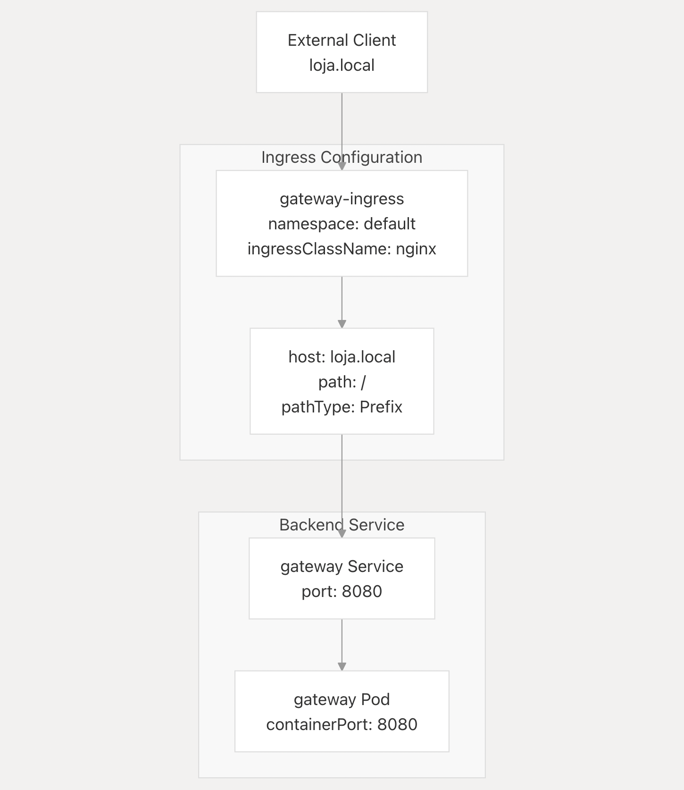

For the Load Balancer, I used the **NGINX Ingress Controller**, which is a popular choice for managing ingress traffic in Kubernetes clusters. It acts as a reverse proxy and load balancer, being the only pod exposed and routing traffic to the gateway thats inside the cluster.

The NGINX Ingress Controller is deployed as a kubernetes pod of type LoadBalancer in the minikube cluster.

In the project, the setup file it located as follows:

```
gateway-service/
    ├── k8s/
    │   └── ingress-gateway.yaml
```


## Request flow


