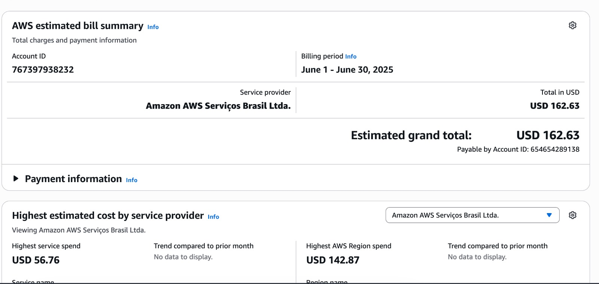
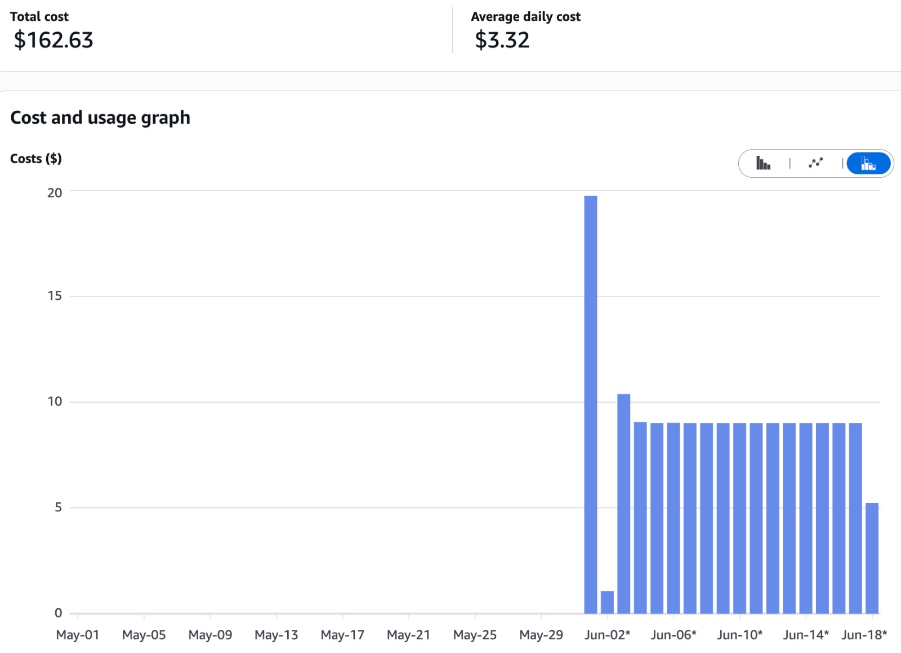
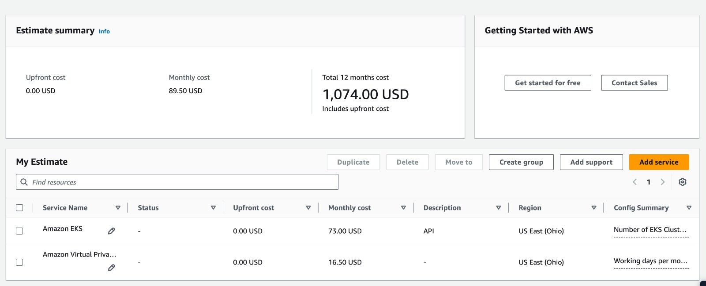

# AWS Cost Overview

---

## Current Spend (June 1st - June 18th)

Total AWS charges to date: **$162.00 USD**

{ width=100% }  
*Figure 1: Detailed cost breakdown since June 1*

{ width=100% }  
*Figure 2: Cost trend chart to date*

---

## 12-Month Forecast

The AWS Cost Explorer projects approximately **$1 074.00 USD** in total charges over the next 12 months—covering the EKS cluster, VPC, and related resources.

{ width=100% }  
*Figure 3: Forecasted AWS spending for the coming year*

> This MkDocs was created by [Gustavo Barroso Souza Cruz](https://github.com/Gubscruz)