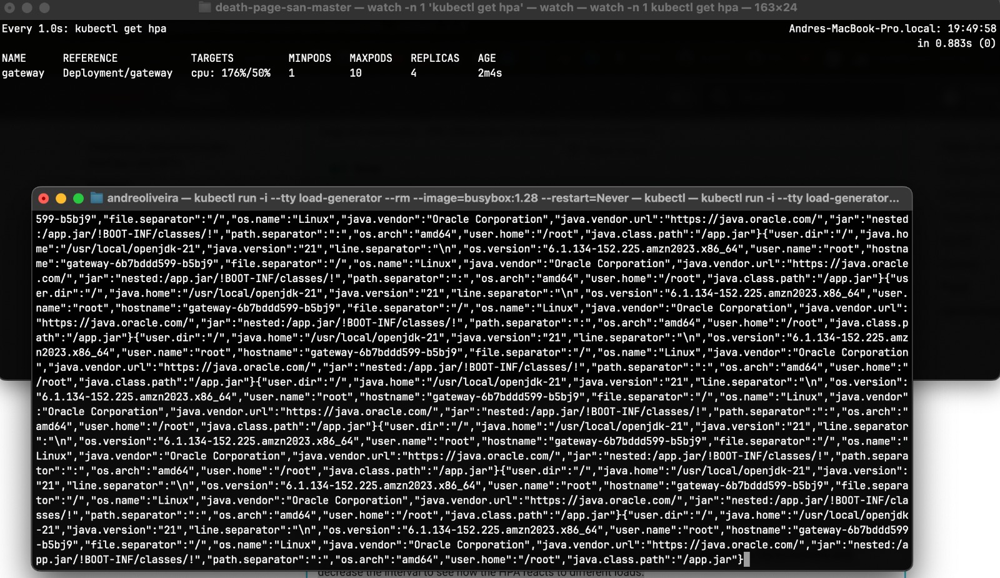
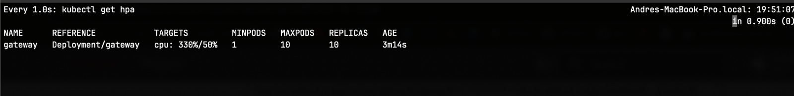
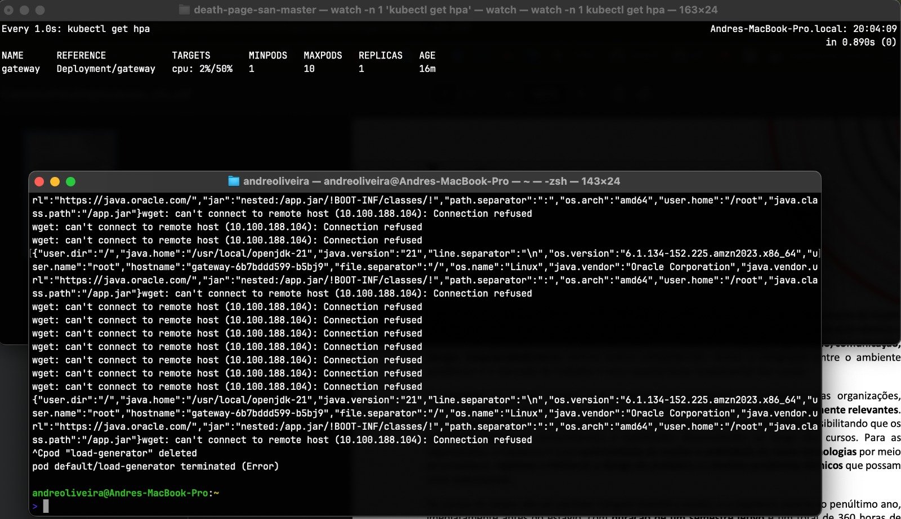

# Horizontal Pod Autoscaler (HPA) Setup

## 1. HPA Configuration Applied

The `gateway` Deployment was autoscaled between 1 and 10 replicas with a target of 50 % CPU utilization:

```bash
kubectl autoscale deployment gateway \
  --cpu-percent=50 \
  --min=1 \
  --max=10
```

## 2. Load Generation

A BusyBox pod was used to generate continuous requests against the `/info` endpoint:

```bash
kubectl run -i --tty load-generator --rm \
  --image=busybox:1.28 --restart=Never \
  -- /bin/sh -c 'while sleep 0.01; do \
    wget -q -O- http://gateway/info; \
  done'
```

---

## 3. Observed Scale-Out

Under load, the HPA **increased** the number of gateway replicas:

{ width=100% }
{ width=100% }

---

## 4. Observed Scale-In

After terminating the load generator, the HPA **decreased** replicas back to the minimum:

{ width=100% }