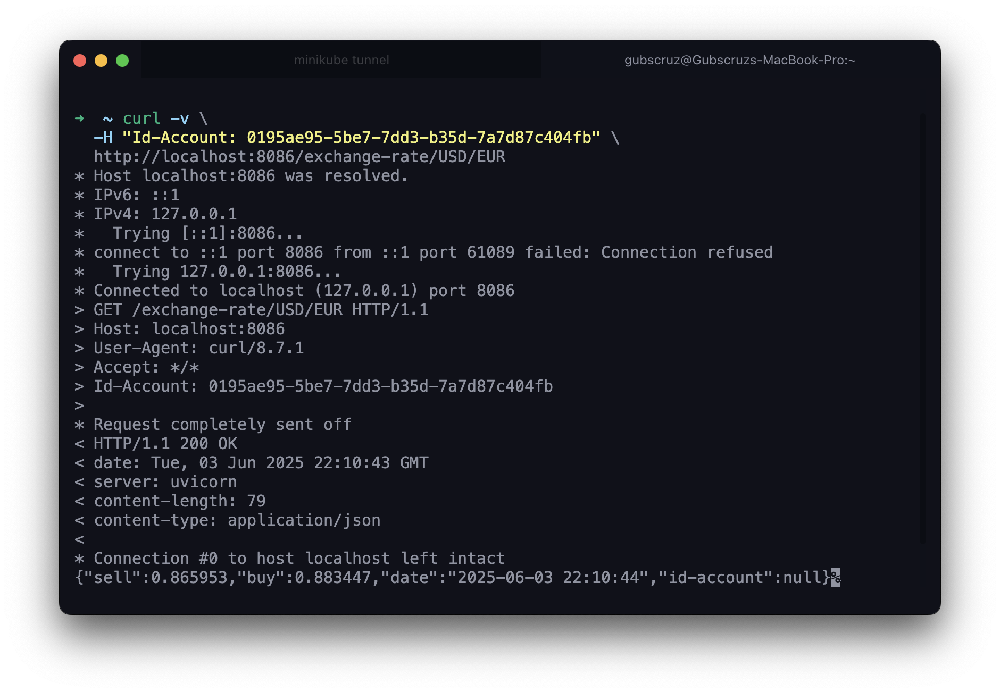

REST API that allows the user to convert between currencies implemented with FastAPI[^1]

!!! info "GET /exchange-rate/{from}/{to}"

    Get the current of a coin from one currency to another. E.g. `GET /coin/USD/EUR`.

    === "Response"

        ``` { .json .copy .select linenums='1' }
        {
            "sell": 0.82,
            "buy": 0.80,
            "date": "2021-09-01 14:23:42",
            "id-account": "0195ae95-5be7-7dd3-b35d-7a7d87c404fb"
        }
        ```
        ```bash
        Response code: 200 (ok)
        ```
    
    === "Postman"
        { width=100% }

This API uses the ExchangeRate API to get the current exchange rates between currencies

- [ExchangeRate-API](https://www.exchangerate-api.com/){target="_blank"};

!!! warning "Attention"

    **To consume the API, the user must be authenticated.**

!!! info "Gateway"

    **This API is consumed through the Gateway of the platform.**

    ``` mermaid
    flowchart LR
        subgraph api
            direction TB
            gateway --> account
            gateway --> auth
            gateway --> others
            account --> db@{ shape: cyl, label: "Database" }
            others --> db
            auth --> account
            gateway e1@==> exchange:::color
            e1@{ animate: true }
        end
        exchange e2@==> 3partyapi@{label: "ExchangeRate API"}
        internet e3@==>|request| gateway
        e2@{ animate: true }
        e3@{ animate: true }
        classDef color fill:#f22
        click exchange "#exchange-api" "Exchange API"
    ```

[^1]: [FastAPI - First Steps](https://fastapi.tiangolo.com/tutorial/first-steps/){target="_blank"}.


Code for the `exchange`:

=== "main.py"

    ``` { .groovy .copy .select linenums="1" }
    --8<-- "https://raw.githubusercontent.com/Gubscruz/platform/refs/heads/main/api/exchange-service/main.py"
    ```