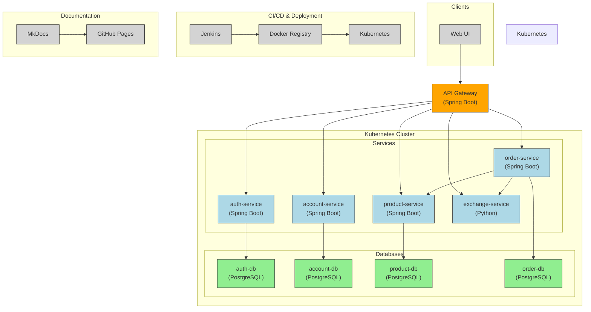

# Store Platform

A **store backend** built as a university project by  
[Gustavo Barroso Souza Cruz](https://github.com/Gubscruz).  
The platform showcases modern micro-services, CI/CD and DevOps practices on top of **Spring Boot 3**, **PostgreSQL**, **Redis**, **Docker / Kubernetes**, **Jenkins** and **MkDocs**.

---

## Key Features
| Layer | Highlights |
|-------|------------|
| **Data** | PostgreSQL schemas per service • Redis cache for hot products and orders |
| **Security** | Bearer token auth & role-based access control |
| **Observability** | Centralised logs, health probes & graceful shutdown |
| **Dev Experience** | One-command bootstrapping with **Docker Compose** & **Makefile** |
| **CI/CD** | Jenkins declarative pipelines → Docker Hub → Minikube/​Kubernetes |
| **Docs** | Auto-published with **MkDocs-Material** + live Mermaid diagrams |

---

## Repository Map

| Domain | “Contract” module | Implementation (Spring Boot service) |
|--------|------------------|---------------------------------------|
| Authentication | [`auth`](api/auth) | [`auth-service`](api/auth-service) |
| Accounts | [`account`](api/account) | [`account-service`](api/account-service) |
| Products | [`product`](api/product) | [`product-service`](api/product-service) |
| Orders | [`order`](api/order) | [`order-service`](api/order-service) |
| Gateway | [`gateway`](api/gateway) | [`gateway-service`](api/gateway-service) |
| Exchange Rates | n/a | [`exchange-service`](api/exchange-service – Python) |

> **Tip:** Each `*-service` folder ships its own Dockerfile,
> Kubernetes manifests (`k8s/*.yaml`) and Jenkinsfile.

---

## High-Level Architecture

