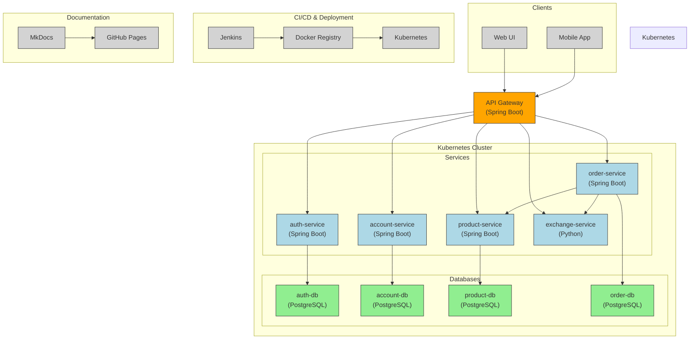

```mermaid
flowchart TB
    subgraph "Clients"
        Web["Web UI"]:::external
        Mobile["Mobile App"]:::external
    end

    Web --> Gateway
    Mobile --> Gateway

    Gateway["API Gateway\n(Spring Boot)"]:::gateway

    subgraph "Kubernetes Cluster"
        style Kubernetes Cluster stroke-dasharray: 5 5
        subgraph "Services"
            Auth["auth-service\n(Spring Boot)"]:::service
            Account["account-service\n(Spring Boot)"]:::service
            Product["product-service\n(Spring Boot)"]:::service
            Order["order-service\n(Spring Boot)"]:::service
            Exchange["exchange-service\n(Python)"]:::service
        end
        subgraph "Databases"
            AuthDB["auth-db\n(PostgreSQL)"]:::db
            AccountDB["account-db\n(PostgreSQL)"]:::db
            ProductDB["product-db\n(PostgreSQL)"]:::db
            OrderDB["order-db\n(PostgreSQL)"]:::db
        end
    end

    Gateway --> Auth
    Gateway --> Account
    Gateway --> Product
    Gateway --> Order
    Gateway --> Exchange

    Auth --> AuthDB
    Account --> AccountDB
    Product --> ProductDB
    Order --> OrderDB

    Order --> Product
    Order --> Exchange

    subgraph "CI/CD & Deployment"
        Jenkins["Jenkins"]:::external
        Registry["Docker Registry"]:::external
        K8s["Kubernetes"]:::external
        Jenkins --> Registry
        Registry --> K8s
    end

    subgraph "Documentation"
        MkDocs["MkDocs"]:::external
        GHPages["GitHub Pages"]:::external
        MkDocs --> GHPages
    end

    click Gateway "https://github.com/gubscruz/platform/tree/main/api/gateway-service"
    click Auth "https://github.com/gubscruz/platform/tree/main/api/auth-service"
    click Account "https://github.com/gubscruz/platform/tree/main/api/account-service"
    click Product "https://github.com/gubscruz/platform/tree/main/api/product-service"
    click Order "https://github.com/gubscruz/platform/tree/main/api/order-service"
    click Exchange "https://github.com/gubscruz/platform/tree/main/api/exchange-service"
    click Jenkins "https://github.com/gubscruz/platform/blob/main/jenkins/compose.yaml"
    click MkDocs "https://github.com/gubscruz/platform/blob/main/mkdocs.yml"
    click GHPages "https://github.com/gubscruz/platform/tree/main/docs/"

    classDef gateway fill:#FFA500,stroke:#333,stroke-width:1px;
    classDef service fill:#ADD8E6,stroke:#333,stroke-width:1px;
    classDef db fill:#90EE90,stroke:#333,stroke-width:1px;
    classDef external fill:#D3D3D3,stroke:#333,stroke-width:1px;
```