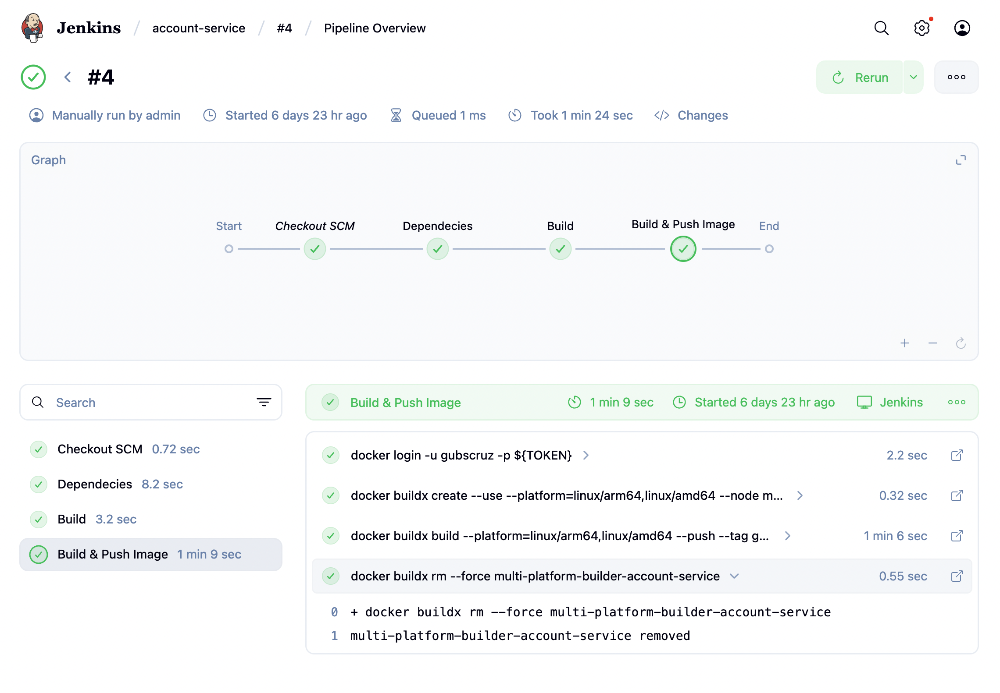
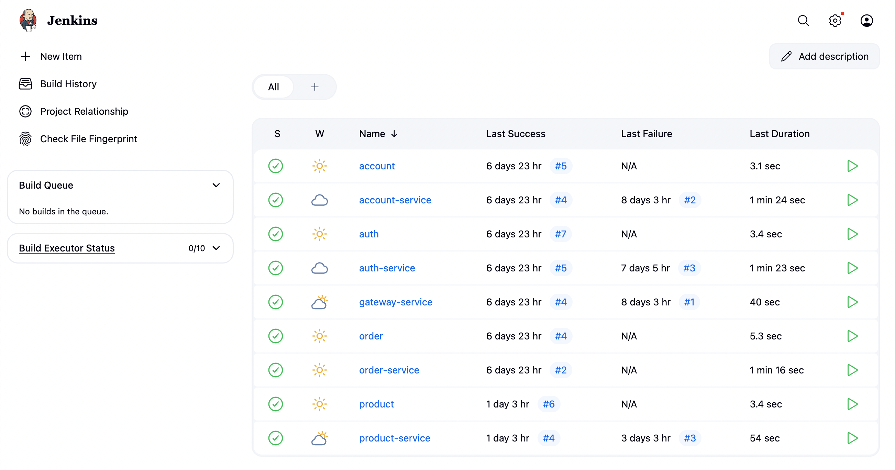
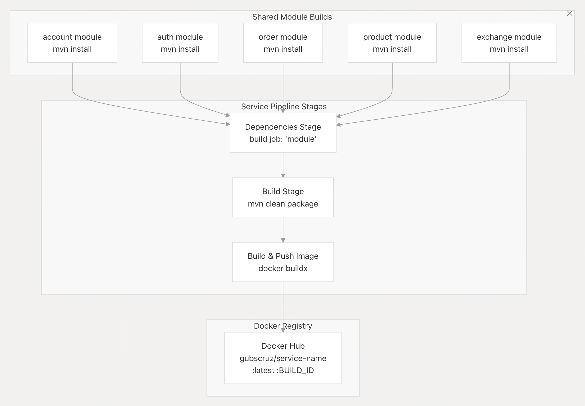
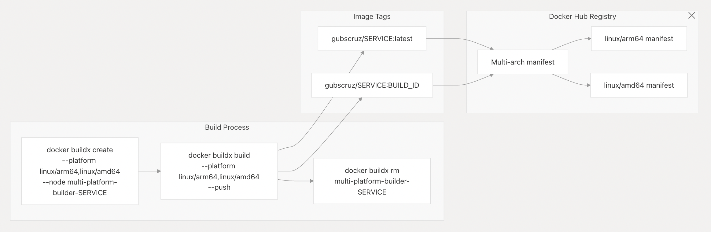

# Jenkins Pipeline Structure

Our Jenkins CI/CD pipeline is composed of four key stages:

1. **Checkout SCM** - Automatically clones the repository from GitHub
2. **Dependencies** - Installs all project dependencies using Maven
3. **Build** - Compiles and packages the application with Maven
4. **Build & Push Image** - Creates multi-architecture Docker images and pushes them to DockerHub

>  **Future Enhancement:** add `kubectl apply` deployment stages once our EKS cluster is ready


## Architecture Diagrams

=== "Jenkins Pipeline"
    { width=100% }

=== "CI/CD Pipeline"
    { width=100% }

=== "Build Artifacts"
    { width=100% }

=== "Build Process"
    { width=100% }


## Jenkins Setup

The Jenkins environment is configured using Docker Compose:

```yaml
# docker compose up -d --build --force-recreate
name: ops

services:

  jenkins:
    container_name: jenkins
    build:
      dockerfile_inline: |
        FROM jenkins/jenkins:jdk21
        USER root

        # Install tools
        RUN apt-get update && apt-get install -y lsb-release iputils-ping maven

        # Install Docker
        RUN curl -fsSLo /usr/share/keyrings/docker-archive-keyring.asc \
          https://download.docker.com/linux/debian/gpg
        RUN echo "deb [arch=$(dpkg --print-architecture) \
          signed-by=/usr/share/keyrings/docker-archive-keyring.asc] \
          https://download.docker.com/linux/debian \
          $(lsb_release -cs) stable" > /etc/apt/sources.list.d/docker.list
        RUN apt-get update && apt-get install -y docker-ce

        # Install kubectl
        RUN apt-get install -y apt-transport-https ca-certificates curl
        RUN curl -fsSL https://pkgs.k8s.io/core:/stable:/v1.30/deb/Release.key | gpg --dearmor -o /etc/apt/keyrings/kubernetes-apt-keyring.gpg
        RUN chmod 644 /etc/apt/keyrings/kubernetes-apt-keyring.gpg
        RUN echo 'deb [signed-by=/etc/apt/keyrings/kubernetes-apt-keyring.gpg] https://pkgs.k8s.io/core:/stable:/v1.30/deb/ /' | tee /etc/apt/sources.list.d/kubernetes.list
        RUN chmod 644 /etc/apt/sources.list.d/kubernetes.list
        RUN apt-get update && apt-get install -y kubectl

        RUN usermod -aG docker jenkins
    ports:
      - 9080:8080
    volumes:
      - ${CONFIG:-./config}/jenkins:/var/jenkins_home
      - /var/run/docker.sock:/var/run/docker.sock
    restart: always
```

## Pipeline Configuration

### Microservice Pipeline

Each microservice contains a `Jenkinsfile` defining the CI/CD process:

```groovy
pipeline {
    agent any
    environment {
        SERVICE = 'product-service'
        NAME = "gubscruz/${env.SERVICE}"
    }
    stages {
        stage('Dependencies') {
            steps {
                build job: 'product', wait: true
            }
        }
        stage('Build') { 
            steps {
                sh 'mvn -B -DskipTests clean package'
            }
        }      
        stage('Build & Push Image') {
            steps {
                withCredentials([usernamePassword(credentialsId: 'dockerhub-credential', usernameVariable: 'USERNAME', passwordVariable: 'TOKEN')]) {
                    sh "docker login -u $USERNAME -p $TOKEN"
                    sh "docker buildx create --use --platform=linux/arm64,linux/amd64 --node multi-platform-builder-${env.SERVICE} --name multi-platform-builder-${env.SERVICE}"
                    sh "docker buildx build --platform=linux/arm64,linux/amd64 --push --tag ${env.NAME}:latest --tag ${env.NAME}:${env.BUILD_ID} -f Dockerfile ."
                    sh "docker buildx rm --force multi-platform-builder-${env.SERVICE}"
                }
            }
        }
    }
}
```

### Contract Pipeline

Contracts use a simplified pipeline focused on building and installing the artifacts:

```groovy
pipeline {
    agent any

    stages {
        stage('Build') {
            steps {
                sh 'mvn -B -DskipTests clean install'
            }
        }
    }
}
```

