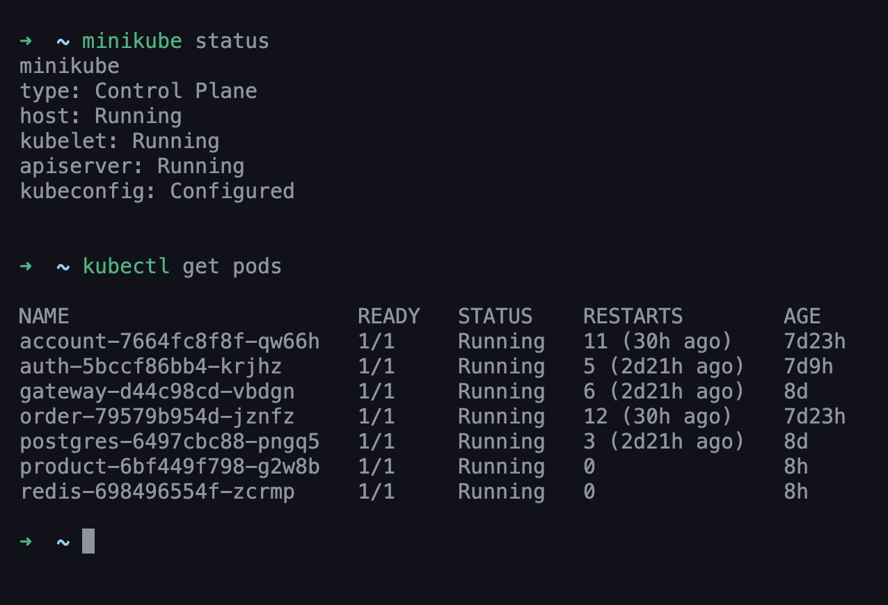
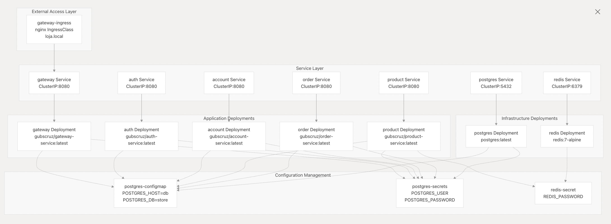
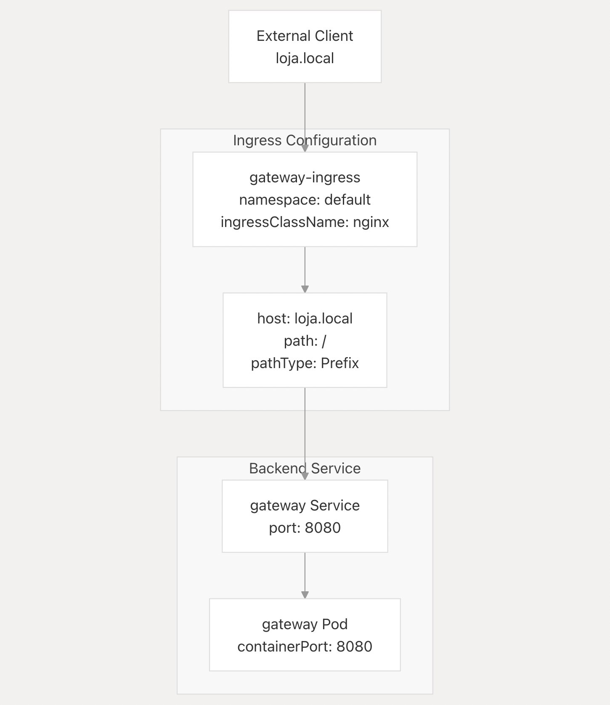

For the minikube setup, I created a folder called `k8s` in each microservice with a `{service}.yaml` file that contains the Kubernetes deployment and service definitions for that microservice. 
Also, in the main `k8s` folder, I have the `postgres.yaml` and `redis.yaml` files, which are the Kubernetes deployment and service definitions for the PostgreSQL and Redis services, respectively.

Structure:
```
k8s/
  ├── postgresql.yaml
  ├── redis.yaml
service1/
  ├── k8s/
  │   └── service1.yaml
service2/
  ├── k8s/
  │   └── service2.yaml
```

Pods:


## Deployment Architecture



## Pods discovery
In the Kubernetes setup, each microservice is deployed as a separate pod. The only pod exposed is the ingress-nginx pod (Load Balancer), which is responsible for routing to the gateway service, who then routes to the other microservices as the ClusterIP is only accessible within the cluster.




## Example of a service.yaml file

```yaml
apiVersion: apps/v1
kind: Deployment
metadata:
  name: product
spec:
  replicas: 1
  selector:
    matchLabels:
      app: product
  template:
    metadata:
      labels:
        app: product
    spec:
      containers:
      - name: product
        image: gubscruz/product-service:latest
        imagePullPolicy: Always
        ports:
        - containerPort: 8080

        env:
        - name: DATABASE_HOST
          valueFrom:
            configMapKeyRef:
              name: postgres-configmap
              key: POSTGRES_HOST
        - name: DATABASE_USER
          valueFrom:
            secretKeyRef:
              name: postgres-secrets
              key: POSTGRES_USER
        - name: DATABASE_PASSWORD
          valueFrom:
            secretKeyRef:
              name: postgres-secrets
              key: POSTGRES_PASSWORD

        - name: SPRING_DATA_REDIS_HOST
          value: redis
        - name: SPRING_DATA_REDIS_PORT
          value: "6379"
---
apiVersion: v1
kind: Service
metadata:
  name: product
  labels:
    app: product
spec:
  type: ClusterIP
  ports:
  - port: 8080
  selector:
    app: product
```


> This MkDocs was created by [Gustavo Barroso Souza Cruz](https://github.com/Gubscruz)